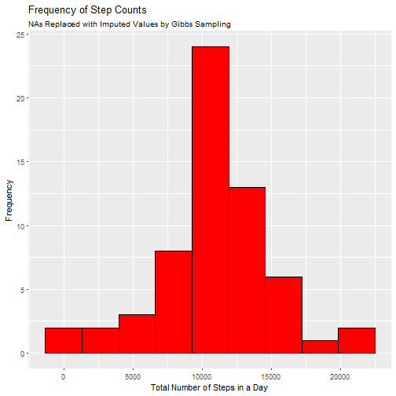

----------------------------------------------------------------------------
Peer-graded Assignment: Course Project 1
----------------------------------------------------------------------------

1. Code for reading in the dataset and/or processing the data

```r
# Test for directory and create if need be
if(!file.exists("AM Data")){
  dir.create("AM Data")
}
# Download and unzip
url <- "https://d396qusza40orc.cloudfront.net/repdata%2Fdata%2Factivity.zip"
download.file(url = url, destfile = "./AM Data/repdata%2Fdata%2Factivity.zip", method = "auto")
unzip("./AM Data/repdata%2Fdata%2Factivity.zip", exdir = "./AM Data")

# Load the data
AM <- read.csv("./AM Data/activity.csv")
```

The data is downloaded and processed into the dataframe AM.


2. Histogram of the total number of steps taken each day


```r
# What is the mean total number of steps taken per day?

# 1. Calculate the total number of steps for each day   
aggregate_steps <- aggregate(steps~date, data = AM, FUN = sum)


# 2. Plot histogram of the total number of steps taken each day. 
## Changed bin numbers to 9 to avoid gaps in the histogram.

library(ggplot2)
g <- ggplot(aggregate_steps, aes(steps))
gb <- g + geom_histogram(color = "black", fill = "steelblue3", bins = 9) 
gba <- gb  
gbac <- gba + labs(title = "Frequency of Step Counts", 
                   subtitle = "NAs Removed", 
                   x = "Total Number of Steps in a Day",
                   y = "Frequency")
print(gbac)
```


3. Mean and median number of steps taken each day

```r
mean1 <- mean(aggregate_steps$steps)
median1 <- median(aggregate_steps$steps)
```
The mean is 1.0766189 &times; 10<sup>4</sup>.  The median is 10765.


4.  Time-series plot of the average number of steps taken

```r
# What is the average daily activity pattern?

# 1.  Construct a time series plot such that shows the relationship between time interval and
#     Calculate the average number of steps taken (averaged across all days, by time interval)
f <- function(x){
      m <- mean(x, na.rm = TRUE)
      m
}
t <- tapply(AM$steps, AM$interval, f)
df <- data.frame(AM$interval[1:288], t)
colnames(df) <- c("interval", "average.steps")


# plot average steps by interval
library(ggplot2)
p <- ggplot(data = df , aes(interval, average.steps))
pg <- p + geom_line( color = "darkred")
pgs <- pg  
pgsl <- pgs + labs(title = "Average Number of Steps/Day by 5-Minute Interval",
                   subtitle = "NAs Removed",
                   x = "5-Minute Intervals",
                   y = "Average Number of Steps per Day")
print(pgsl)
```


```r
# 2. Which 5-minute interval, on average acros all the days in the dataset, contains the maximum number of steps?
max_average <- max(df$average.steps)
row_with_max <- subset(df, df$average.steps == max_average)
max <- (row_with_max[,1])
```
5. The 5-minute interval that, on average contains the maximum number of steps is 835.


6. Code to describe and show a strategy for imputing missing data.

```r
# Imputing Missing Values
# 1.  Calculate and report the total number of missing values in the dataset(i.e. the total number of rows with NAs)
cc <- !complete.cases(AM)
ccc <- (sum(cc))

# 2.  Devise a strategy for imputing missing values
# Is there a pattern?  Use mice package with md.pattern()
library(mice)
md.pattern(AM)
```

```
##       date interval steps     
## 15264    1        1     1    0
##  2304    1        1     0    1
##          0        0  2304 2304
```

```r
# We can see that the NAs are limited to 'steps' variable.  
# I will use the mice function to impute values to the NAs.
library(mice)
imp <- mice(AM, m = 10)
```

```
## 
##  iter imp variable
##   1   1  steps
##   1   2  steps
##   1   3  steps
##   1   4  steps
##   1   5  steps
##   1   6  steps
##   1   7  steps
##   1   8  steps
##   1   9  steps
##   1   10  steps
##   2   1  steps
##   2   2  steps
##   2   3  steps
##   2   4  steps
##   2   5  steps
##   2   6  steps
##   2   7  steps
##   2   8  steps
##   2   9  steps
##   2   10  steps
##   3   1  steps
##   3   2  steps
##   3   3  steps
##   3   4  steps
##   3   5  steps
##   3   6  steps
##   3   7  steps
##   3   8  steps
##   3   9  steps
##   3   10  steps
##   4   1  steps
##   4   2  steps
##   4   3  steps
##   4   4  steps
##   4   5  steps
##   4   6  steps
##   4   7  steps
##   4   8  steps
##   4   9  steps
##   4   10  steps
##   5   1  steps
##   5   2  steps
##   5   3  steps
##   5   4  steps
##   5   5  steps
##   5   6  steps
##   5   7  steps
##   5   8  steps
##   5   9  steps
##   5   10  steps
```

```r
# 3. Create a new dataset that is equal to the original dataset but with the missing data filled in.
AM_complete <- complete(imp, action = sample(1:10, 1))
```

The number of NAs is 2304.
I used the mice package which imputes values determined by Gibbs sampling.


7. Histogram of the total number of steps taken each day after missing values are imputed.

```r
# 4. Make a histogram of the total number of steps taken each day and calculate and report the mean
# and median total number of steps taken per day.
## Are there differences in activity patterns between weekdays and weekends?
##  What is the impact of imputing missing data on the estimates of the total daily
##  number of steps?
aggregate_steps_complete <- aggregate(steps~date, data = AM_complete, FUN = sum)


library(ggplot2)
g <- ggplot(aggregate_steps_complete, aes(steps))
gb <- g + geom_histogram(color = "black", fill = "red", bins = 9) 
gba <- gb 
gbal <- gba + labs(title = "Frequency of Step Counts",
                   subtitle = "NAs Replaced with Imputed Values by Gibbs Sampling",
                   x = "Total Number of Steps in a Day",
                   y = "Frequency")
print(gbal)
```



```r
mean2 <- mean(aggregate_steps$steps)
median2 <- median(aggregate_steps$steps)
```

The new mean is 1.0766189 &times; 10<sup>4</sup>.
The new median is 10765.
The imputed values do not seem to change the apparent patterns in the data.


8.  Panel plot comparing the average number of steps taken per 5-minute interval across weekdays and weekends.

```r
## Are there differences in activity patterns between weekdays and weekends?
# 1.  Create a new factor variable in the dataset with two levels-"weekday" 
# and "weekend" indicating whether a given date is a weekday or weekend day.
library(lubridate)
dates <- as_date(AM_complete$date)
weekday <- weekdays(dates)

f <- function(x){
  day = c("Monday", "Tuesday", "Wednesday", "Thursday", "Friday")
    if(x %in% day){
      y = "weekday"
    }else 
      y = "weekend"
}

kind_of_day <- sapply(weekday, f)
AM_complete <- cbind(AM_complete, kind_of_day)


# 2.  Make a panel plot containing a time series plot (i.e. type = "l") of the
#     5-minute interval (x-axis) and the average number of steps taken,
#     averaged across all weekday days or weekend days (y-axis).  
agg <- aggregate(formula = steps ~ interval + kind_of_day, 
                 data = AM_complete, FUN = mean)
colnames(agg) <- c("interval", "kind.of.day", "average.steps")


# plot average steps by interval

library(ggplot2)
p <- ggplot(data = agg , aes(interval, average.steps))
pg <- p + geom_line(color = "grey6")   
pgg <- pg 
pggf <- pgg + facet_wrap(~kind.of.day)
pggfl <- pggf + labs(title = "Average Number of Steps/Day by 5-Minute Interval",
                     subtitle = "NAs Replaced with Imputed Values by Gibbs Sampling",
                     x = "5-Minute Intervals",
                     y = "Average Number of Steps per Day")
print(pggfl)
```


The average number of steps is generally greater for weekends.
Moreover, the weekend distribution skews right.  
